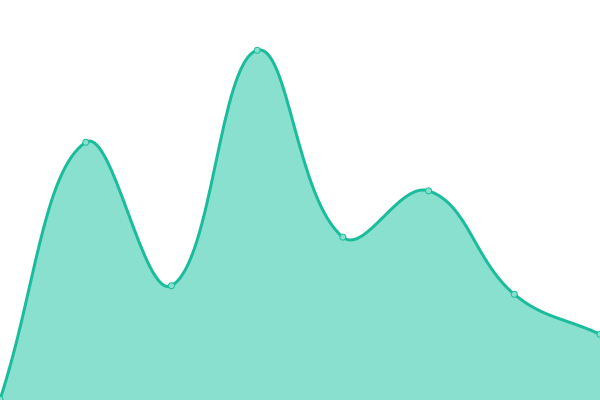
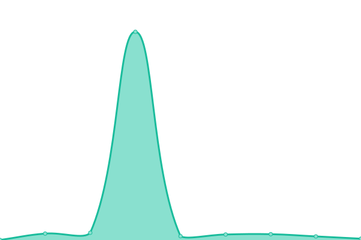
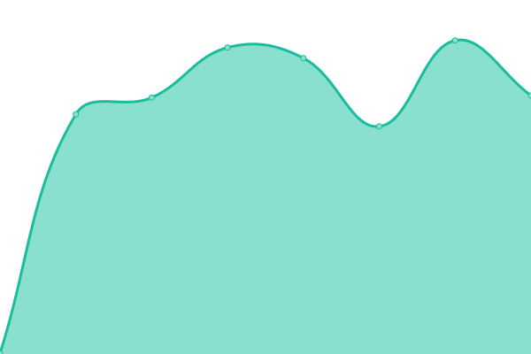

<!--start: status pages-->
<!-- This summary is generated by Upptime (https://github.com/upptime/upptime) -->
<!-- Do not edit this manually, your changes will be overwritten -->
<!-- prettier-ignore -->
| URL | Status | History | Response Time | Uptime |
| --- | ------ | ------- | ------------- | ------ |
|  [Josselin Liebe](https://josselinlie.be) | 🟩 Up | [josselin-liebe.yml](https://github.com/josselinlbe/upptime/commits/HEAD/history/josselin-liebe.yml) | 

 324ms
     
 | 

<a href="https://josselinlbe.github.io/upptime/history/josselin-liebe">100.00%</a>
    

|  [Piloterr](https://piloterr.com) | 🟩 Up | [piloterr.yml](https://github.com/josselinlbe/upptime/commits/HEAD/history/piloterr.yml) | 

 3501ms
     
 | 

<a href="https://josselinlbe.github.io/upptime/history/piloterr">100.00%</a>
    

|  [Retailed](https://www.retailed.io) | 🟩 Up | [retailed.yml](https://github.com/josselinlbe/upptime/commits/HEAD/history/retailed.yml) | 

 596ms
     
 | 

<a href="https://josselinlbe.github.io/upptime/history/retailed">100.00%</a>
    

|  [Veille](https://www.veille.io) | 🟩 Up | [veille.yml](https://github.com/josselinlbe/upptime/commits/HEAD/history/veille.yml) | 

 1561ms
     
 | 

<a href="https://josselinlbe.github.io/upptime/history/veille">100.00%</a>
    

|  [LOFI](https://lofi.media) | 🟩 Up | [lofi.yml](https://github.com/josselinlbe/upptime/commits/HEAD/history/lofi.yml) | 

 560ms
     
 | 

<a href="https://josselinlbe.github.io/upptime/history/lofi">100.00%</a>
    

<!--end: status pages-->

[**Visit our status website →**](https://josselinlbe.github.io/upptime)undefined
